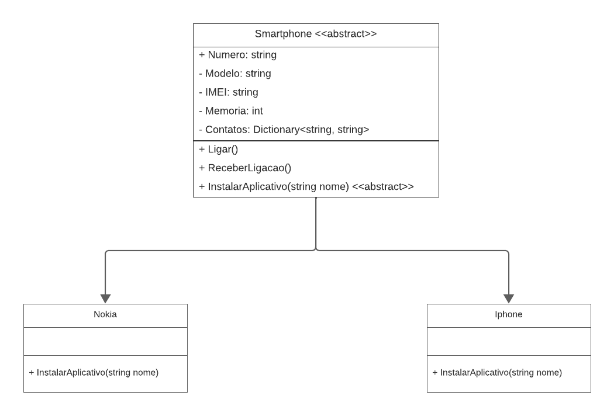

# DIO - Trilha .NET - Programação orientada a objetos
www.dio.me

## Desafio de projeto
Para este desafio, você precisará usar seus conhecimentos adquiridos no módulo de orientação a objetos, da trilha .NET da DIO.

## Contexto
Você é responsável por modelar um sistema que trabalha com celulares. Para isso, foi solicitado que você faça uma abstração de um celular e disponibilize maneiras de diferentes marcas e modelos terem seu próprio comportamento, possibilitando um maior reuso de código e usando a orientação a objetos.

## Proposta
Você precisa criar um sistema em .NET, do tipo console, mapeando uma classe abstrata e classes específicas para dois tipos de celulares: Nokia e iPhone. 
Você deve criar as suas classes de acordo com o diagrama abaixo:

## Regras e validações
1. A classe **Smartphone** deve ser abstrata, não permitindo instanciar e servindo apenas como modelo.
2. A classe **Nokia** e **Iphone** devem ser classes filhas de Smartphone.
3. O método **InstalarAplicativo** deve ser sobrescrito na classe Nokia e iPhone, pois ambos possuem diferentes maneiras de instalar um aplicativo. 

## Solução
- Atualização do Diagrama Entidade Relacionamento;
- Definição e inicialização das propriedades Modelo(string), IMEI(string), Memoria(int) e Contatos(Dictionary<string, string>) na classe Smartphone;
- Sobrescrita do método InstalarAplicativo() nas classes Nokia e Iphone: criação de lista com aplicativos disponíveis e estrutura condicional para validar se o aplicativo informado pelo usuário está disponível para ser instalado;
- Input do aplicativo pelo usuário na classe Program;
- Melhorias no método Ligar() na classe Smartphone: input do número de telefone para ligar, busca e exibição do nome do contato relacionado ao número;
- Atribuição de valores ao dicionário de contatos na classe Program.

## Testes
